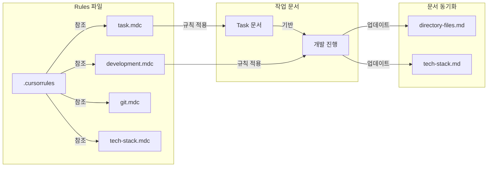

# 프로젝트 워크플로우

## 1. 작업 Flow 다이어그램

<!-- mermaid 등으로 전체 작업 흐름을 시각화하세요. 필요시 텍스트로도 설명 가능 -->
<!-- 예시:
```mermaid
graph TD
    Start[새로운 작업 시작] --> TaskDoc[Task 문서 작성]

    TaskDoc --> |검토 및 승인| GitBranch[Git Feature 브랜치 생성]
    ...

````
-->

## 2. 문서화 규칙 다이어그램
<!-- 문서화/규칙 적용 흐름을 다이어그램이나 표로 정리하세요. -->

## 3. Rules 파일 구조
<!-- 규칙 파일(.cursorrules, .cursor/rules 등) 구조와 역할을 표로 정리하세요. -->
<!-- 예시:
| 파일 | 위치 | 설명 | 주요 내용 |
|------|------|------|----------|
| .cursorrules | 루트 | 프로젝트 전체 워크플로우 규칙 | ... |
| task.mdc | .cursor/rules/ | Task 문서 작성 규칙 | ... |
-->

## 4. 작업 진행 Flow
<!-- 실제 작업 단계별로 필요한 절차, 체크리스트, 승인 조건 등을 작성하세요. -->
<!-- 예시:
1. 새로운 작업 시작
   - Task 문서 생성 및 작성
   - 사용자 검토 및 승인
2. 개발
   - Git feature 브랜치 생성
   - Task 문서 기반 단계별 개발
   - 코드 작성 및 테스트
   - 진행상황 문서화
   - 각 단계 사용자 승인
3. 완료
   - 최종 문서 업데이트
   - main 브랜치 merge
-->

## 5. 핵심 규칙 및 체크리스트
<!-- 문서 우선, 단계별 승인, 문서 동기화 등 핵심 규칙과 실무 체크리스트를 작성하세요. -->
<!-- 예시:
- Task 문서 승인 전 코드 작성 금지
- 모든 변경사항 문서화 필수
- 각 개발 단계는 사용자 승인 필수
- docs/tech-stack.md, docs/directory-files.md 동기화 유지
-->

## 6. 참고 자료
<!-- 공식 문서, 레퍼런스, 내부 위키 등 -->

```mermaid
graph TD
    Start[새로운 작업 시작] --> TaskDoc[Task 문서 작성]
    TaskDoc --> |검토 및 승인| GitBranch[Git Feature 브랜치 생성]

    %% Task 문서 작성 관련 메모
    TaskNote["참고:
    - .cursor/rules/task.mdc
    - tasks/{task-name}.md"]
    TaskDoc -.-> TaskNote

    %% Git 브랜치 생성 관련 메모
    GitNote["참고:
    - .cursor/rules/git.mdc"]
    GitBranch -.-> GitNote

    subgraph Development[개발 단계]
        GitBranch --> Review[Task 요구사항 검토]
        Review --> Code[코드 작성 및 테스트]
        Code --> DocUpdate[진행상황 문서화]
        DocUpdate --> |단계 승인| NextStep{다음 단계?}
        NextStep --> |Yes| Review
        NextStep --> |No| Completion

        %% 개발 단계 관련 메모
        DevNote["참고:
        - .cursor/rules/development.mdc
        - docs/tech-stack.md
        - docs/directory-files.md"]
        Code -.-> DevNote
    end

    subgraph Completion[완료 단계]
        FinalDoc[최종 문서 업데이트] --> MergePR[PR 생성]
        MergePR --> Merge[Main 브랜치 Merge]

        %% 완료 단계 관련 메모
        CompNote["참고:
        - .cursor/rules/git.mdc
        - .cursor/rules/tech-stack.mdc"
        업데이트:
        - docs/tech-stack.md
        - docs/directory-files.md
        ]
        FinalDoc -.-> CompNote
    end

    Development --> FinalDoc
```

## 문서화 규칙 다이어그램



## Rules 파일 구조

| 파일              | 위치             | 설명                          | 주요 내용                                                                                        |
| ----------------- | ---------------- | ----------------------------- | ------------------------------------------------------------------------------------------------ |
| `.cursorrules`    | 루트             | 프로젝트 전체 워크플로우 규칙 | - 작업 진행 Flow<br>- 핵심 규칙<br>- 문서 동기화 규칙                                            |
| `task.mdc`        | `.cursor/rules/` | Task 문서 작성 규칙           | - 문서 생성 위치/형식<br>- 요구사항 작성<br>- 구현 분석<br>- 작업 계획<br>- 작업 진행 체크리스트 |
| `development.mdc` | `.cursor/rules/` | 개발 작업 진행 규칙           | - 선행 조건<br>- 개발 프로세스<br>- 단계 완료 조건<br>- 다음 단계 진행                           |
| `git.mdc`         | `.cursor/rules/` | Git 사용 규칙                 | - 브랜치 전략<br>- 브랜치 명명 규칙<br>- Commit 메시지 규칙                                      |
| `tech-stack.mdc`  | `.cursor/rules/` | 기술 스택 문서화 규칙         | - 초기 문서 작성<br>- 기술 스택 업데이트<br>- 문서화 규칙                                        |

- 위 규칙/문서/온톨로지 파일들은 **프로필 기반 템플릿(.templates/{profile}/) 구조**로 관리하며,
- `cursor-init docs sync [--profile 프로필명]` 명령어로 전체 구조를 한 번에 동기화할 수 있음
- 자세한 구조/예시는 `docs/directory-structure.md` 5장 참조

## 작업 진행 Flow

1. 새로운 작업 시작

   - Task 문서 생성 및 작성 (`tasks/{task-name}.md`)
   - 사용자 검토 및 승인
   - 참고: `task.mdc`

2. 개발 (Development)

   - Git feature 브랜치 생성 (`feature/{task-name}`)
   - Task 문서 기반 단계별 개발
     - Task 문서 요구사항 검토
     - 코드 작성 및 테스트
     - 진행상황 문서화
   - 각 단계 사용자 승인
   - 참고: `development.mdc`

3. 완료 (Completion)
   - 최종 문서 업데이트
   - main 브랜치 merge
   - 참고: `git.mdc`

## 핵심 규칙

1. 문서 우선

   - Task 문서 승인 전 코드 작성 금지
   - 모든 변경사항 문서화 필수

2. 단계별 승인

   - 각 개발 단계는 사용자 승인 필수
   - 승인 없이 다음 단계 진행 금지

3. 문서 동기화
   - `docs/directory-files.md` 구조 정보 유지
   - `docs/tech-stack.md` 기술 스택 정보 유지

## 참고 자료

- 프로필 기반 템플릿 구조 및 sync 워크플로우는 `docs/directory-structure.md` 참고
- 실제 적용 예시 및 장점은 해당 문서의 5장 참조

## 문서/프로필 관리 워크플로우 및 명령어 가이드

> 폴더/파일 구조 설명은 directory-structure.md 참고, 실제 명령어 및 사용법은 본 문서에서 안내합니다.
> 공식 문서 위치는 .cursor/docs/ 입니다.

### push 명령어
- `cursor-init docs push --name {profile}`
  - 현재 프로젝트의 규칙/문서/온톨로지 구조 전체를 `.templates/{profile}-YYYYMMDD/.cursor/docs/` 하위에 동일한 구조로 저장(스냅샷)
  - `--name` 인자에는 snapshot, test 등 간단한 이름만 입력하면 되고, 날짜는 자동으로 `{profile}-YYYYMMDD` 형식으로 붙음
  - 예: `--name snapshot` → `.templates/snapshot-20240612/.cursor/docs/`에 저장

### pull 명령어
- `cursor-init docs pull --profile {profile}`
  - `.templates/{profile}/.cursor/docs/`의 구조를 프로젝트의 .cursor/docs/에 복원/적용

### sync 명령어
- `cursor-init docs sync`
  - `.templates/default/.cursor/docs/`의 구조를 현재 경로의 .cursor/docs/에 복사/동기화

### list 명령어
- `cursor-init docs list`
  - `.templates/` 하위에 저장된 모든 프로필(예: snapshot-20240612, test-20240612 등)을 리스트로 출력
  - 각 프로필의 생성일, 최근 사용일 등 메타데이터도 함께 표시(추후 확장 가능)

### 명령어 활용 예시
```bash
# 현재 상태를 snapshot-20240612 프로필로 저장
cursor-init docs push --name snapshot
# test-20240612 등으로 저장
cursor-init docs push --name test
# 자동으로 snapshot-20240612 등으로 저장 (기본값: snapshot)
cursor-init docs push

# 특정 프로필을 프로젝트에 적용
cursor-init docs pull --profile snapshot-20240612

# default 프로필을 현재 경로에 동기화
cursor-init docs sync

# 저장된 모든 프로필 리스트 확인
cursor-init docs list
```

### 실무 활용 팁
- 실험/변경/실수 후 언제든 특정 시점의 상태로 복원 가능
- 팀/고객/상황별로 다양한 규칙/문서 세트 관리에 유리
- Git 등과 유사한 워크플로우로 진입장벽이 낮음
````
