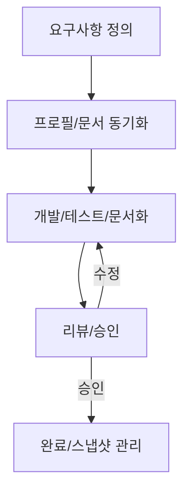

# 프로젝트 워크플로우

## 1. 목적

- 본 문서는 프로젝트의 전체 작업 흐름, 문서화 규칙, 실무 적용 방법을 명확히 안내합니다.
- 프로필 기반 템플릿 구조와 자동화 명령어를 활용한 실무 워크플로우를 표준화합니다.

---

## 2. 전체 작업 흐름

- 요구사항 정의 → 문서/규칙/프로필 동기화 → 개발/테스트/문서화 → 리뷰/승인 → 완료/스냅샷 관리
- 모든 공식 문서/프로필/규칙은 `.cursor-init/docs/`, `.cursor-init/profiles/` 하위에서 관리

### 작업 Flow 다이어그램 (예시)



---

## 3. 문서화/규칙 구조 및 관리

- `.cursorrules`, `rules/`, `docs/` 등은 프로필별로 분리 관리
- 모든 문서/규칙/스냅샷은 공식 경로에 저장, 변경 시 반드시 최신화
- 주요 규칙 파일 예시:
  - `.cursorrules`: 프로젝트 전체 워크플로우/실무 규칙
  - `task.mdc`: Task 문서 작성 규칙
  - `development.mdc`: 개발 작업 진행 규칙
  - `git.mdc`: Git 사용 규칙
  - `tech-stack.mdc`: 기술 스택 문서화 규칙

---

## 4. 실무 적용 및 명령어 예시

### 기본 명령어

```bash
# 템플릿/문서 구조 동기화
uvx cursor-init sync

# 현재 상태를 snapshot-20240612 프로필로 저장
cursor-init docs push --name snapshot

# 특정 프로필을 프로젝트에 적용
cursor-init docs pull --profile snapshot-20240612

# 저장된 모든 프로필 리스트 확인
cursor-init docs list
```

### 실무 적용 예시

1. 템플릿/문서 구조 동기화
   ```bash
   uvx cursor-init sync
   ```
2. 요구사항 정의 및 agent 활용
   ```bash
   # 예시: 신규 회원가입 기능 설계 요구사항을 agent에게 입력
   agent "신규 회원가입 기능 설계: 이메일 인증, 비밀번호 정책, API 명세를 포함. 요구사항에 맞게 문서를 업데이트 해주세요."
   ```

- agent를 활용하면 요구사항 분석, 시스템 설계, 문서화, 체크리스트 관리 등 실무 전 과정을 일관되게 자동화할 수 있습니다.
- 팀/고객/상황별로 프로필을 분리해 다양한 규칙/문서 세트를 손쉽게 적용하세요.

---

## 5. 핵심 규칙 및 체크리스트

- Task 문서 승인 전 코드 작성 금지, 모든 변경사항 문서화 필수
- 각 개발 단계는 사용자 승인 필수, 승인 없이 다음 단계 진행 금지
- 구조/규칙/문서 변경 시 반드시 공식 경로(.cursor-init/docs/)에 최신화

---

## 6. 구현 현황 및 향후 계획 (2025-04-21 기준)

- `sync` 명령어는 default 프로필 기준 실제 파일 복사 구현 완료
- `pull`, `push` 명령어는 현재 메시지 출력만 동작(추후 실제 파일 복사 및 메타데이터 자동화 예정)
- 향후 mcp-server-time 연동, created_at/update_at 자동화, 실무 규칙 준수 기능 고도화 예정
